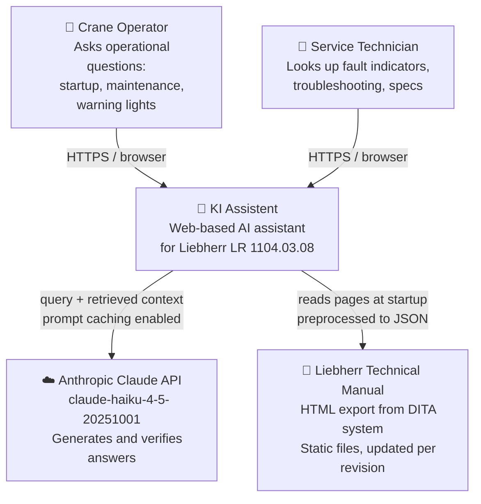
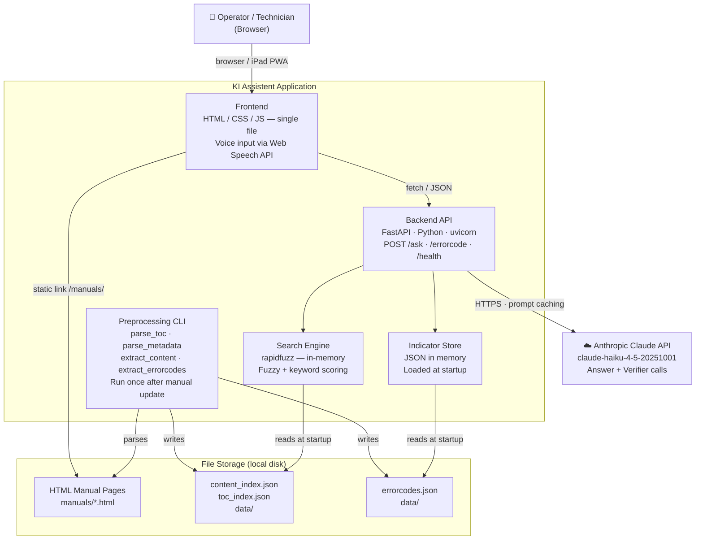

# Architecture — KI Assistent

Reference document for technical discussions.
Current state: **MTP-Demo**, single machine model, deployed on Railway.

---

## C4 Level 1 — System Context



**How to read this diagram:**
Boxes with a person icon are human users. Boxes with a robot or cloud icon are systems. Arrows show which direction data flows; the label describes the protocol or content. This level answers: *who uses the system, and what does it depend on externally?*

**Key architectural decisions at this level:**

- The LLM (Claude) never reads the full manual. It only receives the 3–5 most relevant pages retrieved by the search layer. This keeps latency low and costs predictable.
- The manual is static input — no live connection to Liebherr systems.
- All AI generation requires internet access to the Anthropic API. There is no offline fallback.

---

## C4 Level 2 — Container



**How to read this diagram:**
"Container" in C4 terminology means any independently deployable unit — a running process, a web app, or a data store. It is not related to Docker. The `APP` subgraph is everything that runs on the server; `STORE` is the data that lives on disk. Arrows inside the app boundary are in-process function calls (no network hop); arrows crossing to `CLAUDE` are real HTTPS requests to Anthropic's servers.

**Deployment (current):** Railway (cloud PaaS). Auto-deploys on push to `main`. Frontend and backend run in the same process — FastAPI mounts `/frontend`, `/design-system`, and `/manuals` as static directories.

### Request flow — POST /ask

```
Browser → POST /ask {"question": "..."}
  └─ search.py       retrieves top-5 pages from content_index.json (in-memory)
  └─ claude_client.answer()   → Anthropic API (2-block prompt with caching)
  └─ claude_client.verify()   → Anthropic API (same context, cached)
  └─ AskResponse { answer, grounding, sources[] }
Browser ← JSON
  └─ renderMarkdown() renders answer
  └─ renderAnswer() renders source list: title, filename, score
  └─ Source links open /manuals/<filename> in new tab (static file)
```

Total latency: ~1–2 s (Haiku), dominated by two sequential Anthropic API calls.

### Request flow — POST /errorcode

```
Browser → POST /errorcode {"code": "1042"}
  └─ dict lookup in errorcodes.json (in-memory, instant)
  └─ search.py  retrieves top-3 related pages (no API call)
  └─ ErrorCodeResponse { code, description, cause, action, related }
Browser ← JSON
```

No LLM call for error code lookup — sub-100 ms response time.

---

## Claude API — Payload & Two-Call Design

Every `/ask` request results in **two sequential API calls** to Anthropic. This section shows the exact payload structure for each call and explains the design decisions behind it.

### Why two calls?

A single LLM call could hallucinate without knowing it. The second call is an independent model instance that checks: *"Does what Call 1 answered actually match the manual content?"* — like a second pair of eyes. If the verdict is `NICHT_BELEGT`, the answer is discarded and replaced by an explicit disclaimer. This is the right design for safety-critical equipment.

### Call 1 — `answer()`: generate the answer

```json
POST https://api.anthropic.com/v1/messages

{
  "model": "claude-haiku-4-5-20251001",
  "max_tokens": 1024,

  "system": [
    {
      "type": "text",
      "text": "Du bist ein Assistent für Liebherr-Maschinenführer und Servicetechniker. Antworte ausschließlich auf Basis des gegebenen Kontext-Materials ...",
      "cache_control": { "type": "ephemeral" }
    }
  ],

  "messages": [
    {
      "role": "user",
      "content": [
        {
          "type": "text",
          "text": "Kontext-Material:\n\n### Getriebeöl prüfen (Wartung › Schmierung)\n  1. Motor abstellen.\n  2. Ölstand am Schauglas prüfen ...\n\n---\n\n### Wartungsintervalle (...)\n ...",
          "cache_control": { "type": "ephemeral" }
        },
        {
          "type": "text",
          "text": "Frage: Wie oft muss ich das Getriebeöl wechseln?"
        }
      ]
    }
  ]
}
```

### Call 2 — `verify()`: check grounding

```json
POST https://api.anthropic.com/v1/messages

{
  "model": "claude-haiku-4-5-20251001",
  "max_tokens": 10,

  "system": [
    {
      "type": "text",
      "text": "Du prüfst, ob eine gegebene Antwort vollständig durch den Kontext belegt ist. Antworte ausschließlich mit: BELEGT / TEILWEISE / NICHT_BELEGT",
      "cache_control": { "type": "ephemeral" }
    }
  ],

  "messages": [
    {
      "role": "user",
      "content": [
        {
          "type": "text",
          "text": "Kontext-Material:\n\n[identical to Call 1]",
          "cache_control": { "type": "ephemeral" }
        },
        {
          "type": "text",
          "text": "Antwort:\nDas Getriebeöl muss alle 1000 Betriebsstunden gewechselt werden ..."
        }
      ]
    }
  ]
}
```

Claude responds with exactly one word: `BELEGT`, `TEILWEISE`, or `NICHT_BELEGT`. `max_tokens: 10` enforces this.

### How the context block is built

`_build_context()` in `claude_client.py` assembles the manual pages retrieved by search into a single text block:

```
### {page title} ({breadcrumb path})
  ⚠ {warning text, if any}
  1. {step 1}
  2. {step 2}
  ...
{free text, capped at 1 500 chars per page}

---

### {next page title} ...
```

Typically 2 000–6 000 tokens for 5 retrieved pages. Claude never sees pages that were not retrieved — the full manual is never in the prompt.

### Prompt caching — what it means

Each content block marked `"cache_control": {"type": "ephemeral"}` is stored on Anthropic's servers after the first request. On subsequent requests with the same content, Anthropic skips re-processing that block and charges ~10× less for those cached tokens.

| Block | Cached? | Rationale |
|-------|---------|-----------|
| System prompt | Yes | Identical on every request |
| Context block (manual pages) | Yes | Same pages → same block; Call 2 reuses Call 1's cache entry |
| User question | No | Unique per request |
| Answer (in Call 2) | No | Unique per request |

For the cache to activate, the cached prefix must exceed 1 024 tokens (Haiku minimum). The system prompt alone (~250 tokens) does not reach this threshold on its own, but system prompt + context block combined easily exceed it with real manual content.

### End-to-end timing

```
User submits question
  │
  ├─ search.py          in-memory retrieval          ~5 ms
  ├─ _build_context()   assemble text block          ~1 ms
  ├─ Call 1 (answer)    Haiku, 1024 max tokens      ~800–1500 ms
  └─ Call 2 (verify)    Haiku, 10 max tokens        ~200–400 ms
                        (context served from cache)
                                                    ──────────
                        Total                       ~1–2 s
```

The `/errorcode` endpoint makes **no API call** — it is a plain dict lookup in memory and returns in under 100 ms.

---

## Demo shortcuts

The fastest paths to show value in a demo:

**Q&A tab — good starter questions (with full manual loaded):**
- `"Was muss ich täglich vor der Inbetriebnahme prüfen?"` — triggers maintenance checklist
- `"Wie oft muss das Getriebeöl gewechselt werden?"` — triggers interval table
- `"Was bedeutet die rote Warnlampe am Bildschirm?"` — triggers error/alarm section
- `"Welches Hydrauliköl ist vorgeschrieben?"` — triggers spec lookup

**Error code tab:**
- Enter a real Liebherr error code (e.g., `1042`) — shows structured result + related pages
- The lookup is instant (no API call), a good contrast to the Q&A latency

**Voice input:**
- Click the microphone, speak a question in German — shows the speech-to-text transcription filling the input field
- Works in Chrome/Edge on desktop and Android

**Grounding indicator:**
- Intentionally ask something vague or off-topic (e.g., `"Wie ist das Wetter?"`)
- The verifier returns NICHT_BELEGT and the fallback disclaimer is shown

---

## Scalability analysis

### Current constraints (demo-level)

| Component | Constraint | Impact |
|-----------|-----------|--------|
| Search index | In-memory, single process | Cannot scale horizontally; each worker loads its own copy |
| Error code store | In-memory dict | Fine up to ~50 000 codes; no concern for this use case |
| FastAPI | Single uvicorn process | Add Gunicorn + workers for basic concurrency; Kubernetes for fleet scale |
| Anthropic API | External dependency | Rate limits apply; add retry/backoff for production (partially done) |
| File storage | Local disk | No replication; single point of failure for manual files |
| Authentication | None | Any network-reachable device can call the API |
| Manual loading | Manual copy + re-run scripts | No change detection, no versioning |

### What needs to change for production

1. **Authentication** — API key or SSO (Liebherr AD/EntraID) before exposing outside LAN
2. **Rate limiting** — prevent runaway API cost; per-user quotas
3. **Multi-machine namespace** — separate content indexes per machine model; router in `search.py`
4. **Manual sync pipeline** — replace manual copy with watched folder or webhook from TechPub (see below)
5. **Persistent storage** — move JSON indexes to a lightweight DB (SQLite sufficient for single-site; PostgreSQL for multi-site)
6. **Structured logging + monitoring** — question volume, API cost per day, cache hit rate

### What scales without changes

- The retrieval algorithm (rapidfuzz) handles 500–5 000 pages with no meaningful latency change
- Prompt caching already reduces repeat-question cost ~10×
- The frontend is a static file — scales to any CDN

---

## iPad / tablet deployment

### Status: implemented

1. **Responsive layout** — `@media (max-width: 768px)` hides the sidebar and shows a fixed bottom navigation bar with the same two tabs. `env(safe-area-inset-bottom)` padding prevents content from hiding behind the iPhone home indicator.
2. **PWA manifest** — `frontend/manifest.json` with `display: standalone`. Meta tags `apple-mobile-web-app-capable`, `apple-mobile-web-app-status-bar-style`, and `apple-mobile-web-app-title` are set in `<head>`. Safari on iOS shows "Add to Home Screen" → installs as full-screen app with icon.
3. **Icons** — placeholder PNGs (`icon-192.png`, `icon-512.png`, solid `#1a1f2e`) are committed. Replace with branded Liebherr assets before production.

The backend stays unchanged and can run on any server the tablet reaches (LAN, VPN, or Railway cloud).

### Voice input on iOS (Web Speech API)

Safari on iOS supports `SpeechRecognition` since iOS 14.5. The implementation already uses Web Speech API. On iOS, the audio is processed by Apple's on-device or OS-managed STT — the raw audio signal does not leave the device. This satisfies the requirement of keeping audio local.

```
User speaks
  → iOS SpeechRecognition API (OS-managed, on-device or Apple server)
  → transcript string
  → filled into the question input field
  → user confirms and sends
  → only the text reaches the backend (never audio)
```

**Limitation:** iOS requires user gesture to start `SpeechRecognition` and shows a microphone permission prompt once. The current implementation handles this correctly.

### Corporate SSL proxy (Windows local dev)

On corporate networks with SSL inspection (e.g. Liebherr internal), Python's `httpx` client cannot verify the proxy's re-signed certificate because it does not use the Windows certificate store. Fix: install `truststore` (`pip install truststore`). `backend/main.py` calls `truststore.inject_into_ssl()` at startup inside a `try/except ImportError` — no effect on Railway (Linux, no proxy).

### True offline operation

Not feasible with the current architecture. The answer generation step requires the Anthropic API. Options if offline is required:

| Option | Effort | Quality |
|--------|--------|---------|
| Cache top-50 questions/answers locally | Low | Limited coverage |
| Run a local LLM (Ollama + Llama 3) on a server in the cab | High | Lower than Haiku |
| Pre-generate all error code answers offline | Medium | Good for error codes only |

For a pilot, "cache the 50 most common questions" is the pragmatic answer.

---

## Manual sync

### Current state

Manual process: copy HTML files → `manuals/` → run 4 preprocessing scripts → restart server.

### Recommended sync design

```
Liebherr TechPub system
  │  publishes new manual revision (HTML export ZIP)
  ▼
Sync script (cron or webhook trigger)
  ├─ unzip to manuals/
  ├─ python -m preprocessing.parse_toc
  ├─ python -m preprocessing.parse_metadata
  ├─ python -m preprocessing.extract_content
  ├─ python -m preprocessing.extract_errorcodes
  └─ POST /admin/reload  (hot-reload indexes without restart)
```

The `/admin/reload` endpoint (not yet built) would call `reset_index()` and reload JSON files without restarting the uvicorn process. This is a ~30-line addition to `main.py`.

**Manual version tracking:** The TOC index (`toc_index.json`) should store the manual version string. The frontend can display it ("Handbuch V03.06") so technicians know which revision they are consulting.

---

## Offline operation

**Short answer: not possible in the current architecture.**

The answer generation step (`claude_client.answer()`) requires a live HTTPS connection to `api.anthropic.com`. There is no local fallback.

**What works without the Anthropic API:**
- Error code lookup (dict lookup, no API call)
- Manual page display (static HTML files, served locally)
- Search result list (rapidfuzz, in-memory)

**What does not work offline:**
- Natural-language answer synthesis
- Grounding verification

For a field scenario with no connectivity, the error code tab alone is still useful (instant lookup, no API needed), and the source links open the original HTML pages which are served locally.

---

## Comparison: industry AI assistants

| Product | Input | Output | Offline | Manual scope |
|---------|-------|--------|---------|--------------|
| **KI Assistent (this)** | Text / voice (STT) | Structured text + source link | Partial (error codes) | Single machine, one language |
| **CAT SIS Web** | Text search | Parts diagrams, procedures | No | Full fleet, multi-language |
| **Hey Tadano** | Voice / text | Natural language, crane specs | No | Tadano product range |
| **Liebherr Assistance System** | Touch UI | Guided procedures | Partial | Selected machine lines |

The differentiator here is the **grounding verifier** — the system explicitly signals when it cannot answer from the manual, rather than hallucinating. This is the right design for safety-critical equipment.

---

## Recommended next steps (prioritised)

| Priority | Item | Effort | Status |
|----------|------|--------|--------|
| 1 | Upload full manual, validate Q&A quality | 2 h | Manuals deployed (HTML+CSS, ohne Bilder) |
| 2 | Responsive CSS for tablet / iPad | 4 h | **Erledigt** |
| 3 | PWA manifest for home-screen install | 1 h | **Erledigt** |
| 4 | Inline question input on error code result | 3 h | **Erledigt** |
| 5 | Quellenlinks unter KI-Antworten | 1 h | **Erledigt** |
| 6 | `/admin/reload` endpoint for hot manual sync | 2 h | Offen |
| 7 | Authentication (API key header) | 4 h | Offen |
| 8 | Conversation history (last 2 turns) | 4 h | Offen |
| 9 | Manual images hosting (Cloudflare R2 o. ä.) | 3 h | Offen — 240 MB zu groß für Git |
| 10 | Branded PWA icons (192 + 512 px) | 1 h | Offen — Platzhalter aktiv |
