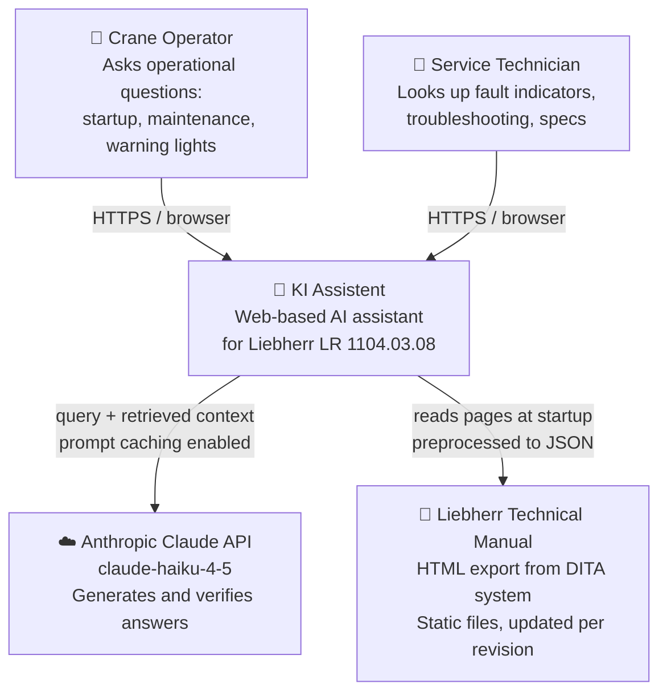
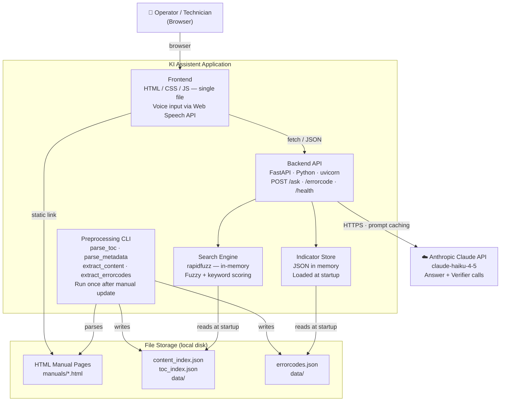

# Architecture — KI Assistent

Reference document for technical discussions.
Current state: **click-demo**, single machine model, local deployment.

---

## C4 Level 1 — System Context



**Key architectural decisions at this level:**

- The LLM (Claude) never reads the full manual. It only receives the 3–5 most relevant pages retrieved by the search layer. This keeps latency low and costs predictable.
- The manual is static input — no live connection to Liebherr systems.
- All AI generation requires internet access to the Anthropic API. There is no offline fallback.

---

## C4 Level 2 — Container



### Request flow — POST /ask

```
Browser → POST /ask {"question": "..."}
  └─ search.py       retrieves top-5 pages from content_index.json (in-memory)
  └─ claude_client.answer()   → Anthropic API (2-block prompt with caching)
  └─ claude_client.verify()   → Anthropic API (same context, cached)
  └─ AskResponse { answer, grounding, sources }
Browser ← JSON
  └─ renderMarkdown() renders answer
  └─ Source links open manuals/<filename>.html (static file)
```

Total latency: ~1–2 s (Haiku), dominated by two sequential Anthropic API calls.

### Request flow — POST /errorcode

```
Browser → POST /errorcode {"code": "1042"}
  └─ dict lookup in errorcodes.json (in-memory, instant)
  └─ search.py  retrieves top-3 related pages (no API call)
  └─ ErrorCodeResponse { code, description, cause, action, related }
Browser ← JSON
```

No LLM call for error code lookup — sub-100 ms response time.

---

## Demo shortcuts

The fastest paths to show value in a demo:

**Q&A tab — good starter questions (with full manual loaded):**
- `"Was muss ich täglich vor der Inbetriebnahme prüfen?"` — triggers maintenance checklist
- `"Wie oft muss das Getriebeöl gewechselt werden?"` — triggers interval table
- `"Was bedeutet die rote Warnlampe am Bildschirm?"` — triggers error/alarm section
- `"Welches Hydrauliköl ist vorgeschrieben?"` — triggers spec lookup

**Error code tab:**
- Enter a real Liebherr error code (e.g., `1042`) — shows structured result + related pages
- The lookup is instant (no API call), a good contrast to the Q&A latency

**Voice input:**
- Click the microphone, speak a question in German — shows the speech-to-text transcription filling the input field
- Works in Chrome/Edge on desktop and Android

**Grounding indicator:**
- Intentionally ask something vague or off-topic (e.g., `"Wie ist das Wetter?"`)
- The verifier returns NICHT_BELEGT and the fallback disclaimer is shown

---

## Scalability analysis

### Current constraints (demo-level)

| Component | Constraint | Impact |
|-----------|-----------|--------|
| Search index | In-memory, single process | Cannot scale horizontally; each worker loads its own copy |
| Error code store | In-memory dict | Fine up to ~50 000 codes; no concern for this use case |
| FastAPI | Single uvicorn process | Add Gunicorn + workers for basic concurrency; Kubernetes for fleet scale |
| Anthropic API | External dependency | Rate limits apply; add retry/backoff for production (partially done) |
| File storage | Local disk | No replication; single point of failure for manual files |
| Authentication | None | Any network-reachable device can call the API |
| Manual loading | Manual copy + re-run scripts | No change detection, no versioning |

### What needs to change for production

1. **Authentication** — API key or SSO (Liebherr AD/EntraID) before exposing outside LAN
2. **Rate limiting** — prevent runaway API cost; per-user quotas
3. **Multi-machine namespace** — separate content indexes per machine model; router in `search.py`
4. **Manual sync pipeline** — replace manual copy with watched folder or webhook from TechPub (see below)
5. **Persistent storage** — move JSON indexes to a lightweight DB (SQLite sufficient for single-site; PostgreSQL for multi-site)
6. **Structured logging + monitoring** — question volume, API cost per day, cache hit rate

### What scales without changes

- The retrieval algorithm (rapidfuzz) handles 500–5 000 pages with no meaningful latency change
- Prompt caching already reduces repeat-question cost ~10×
- The frontend is a static file — scales to any CDN

---

## iPad / tablet deployment

### Short path (6–8 hours of work)

The frontend already runs in Safari on iPad. Two changes unlock a good experience:

1. **Responsive layout** — the sidebar is currently fixed at 216 px. Add a CSS breakpoint (`@media (max-width: 768px)`) to switch to bottom tabs. No JS changes needed.
2. **PWA manifest** — add a `manifest.json` and `<link rel="manifest">` to the HTML. The user can then "Add to Home Screen" → full-screen, icon on home screen, no browser chrome. No App Store required for internal enterprise distribution (MDM push or link-based install).

The backend stays unchanged and can run on any server the tablet reaches (LAN, VPN, or cloud).

### Voice input on iOS (Web Speech API)

Safari on iOS supports `SpeechRecognition` since iOS 14.5. The implementation already uses Web Speech API. On iOS, the audio is processed by Apple's on-device or OS-managed STT — the raw audio signal does not leave the device. This satisfies the requirement of keeping audio local.

```
User speaks
  → iOS SpeechRecognition API (OS-managed, on-device or Apple server)
  → transcript string
  → filled into the question input field
  → user confirms and sends
  → only the text reaches the backend (never audio)
```

**Limitation:** iOS requires user gesture to start `SpeechRecognition` and shows a microphone permission prompt once. The current implementation handles this correctly.

### True offline operation

Not feasible with the current architecture. The answer generation step requires the Anthropic API. Options if offline is required:

| Option | Effort | Quality |
|--------|--------|---------|
| Cache top-50 questions/answers locally | Low | Limited coverage |
| Run a local LLM (Ollama + Llama 3) on a server in the cab | High | Lower than Haiku |
| Pre-generate all error code answers offline | Medium | Good for error codes only |

For a pilot, "cache the 50 most common questions" is the pragmatic answer.

---

## Manual sync

### Current state

Manual process: copy HTML files → `manuals/` → run 4 preprocessing scripts → restart server.

### Recommended sync design

```
Liebherr TechPub system
  │  publishes new manual revision (HTML export ZIP)
  ▼
Sync script (cron or webhook trigger)
  ├─ unzip to manuals/
  ├─ python -m preprocessing.parse_toc
  ├─ python -m preprocessing.parse_metadata
  ├─ python -m preprocessing.extract_content
  ├─ python -m preprocessing.extract_errorcodes
  └─ POST /admin/reload  (hot-reload indexes without restart)
```

The `/admin/reload` endpoint (not yet built) would call `reset_index()` and reload JSON files without restarting the uvicorn process. This is a ~30-line addition to `main.py`.

**Manual version tracking:** The TOC index (`toc_index.json`) should store the manual version string. The frontend can display it ("Handbuch V03.06") so technicians know which revision they are consulting.

---

## Offline operation

**Short answer: not possible in the current architecture.**

The answer generation step (`claude_client.answer()`) requires a live HTTPS connection to `api.anthropic.com`. There is no local fallback.

**What works without the Anthropic API:**
- Error code lookup (dict lookup, no API call)
- Manual page display (static HTML files, served locally)
- Search result list (rapidfuzz, in-memory)

**What does not work offline:**
- Natural-language answer synthesis
- Grounding verification

For a field scenario with no connectivity, the error code tab alone is still useful (instant lookup, no API needed), and the source links open the original HTML pages which are served locally.

---

## Comparison: industry AI assistants

| Product | Input | Output | Offline | Manual scope |
|---------|-------|--------|---------|--------------|
| **KI Assistent (this)** | Text / voice (STT) | Structured text + source link | Partial (error codes) | Single machine, one language |
| **CAT SIS Web** | Text search | Parts diagrams, procedures | No | Full fleet, multi-language |
| **Hey Tadano** | Voice / text | Natural language, crane specs | No | Tadano product range |
| **Liebherr Assistance System** | Touch UI | Guided procedures | Partial | Selected machine lines |

The differentiator here is the **grounding verifier** — the system explicitly signals when it cannot answer from the manual, rather than hallucinating. This is the right design for safety-critical equipment.

---

## Recommended next steps (prioritised)

| Priority | Item | Effort |
|----------|------|--------|
| 1 | Upload full manual, validate Q&A quality | 2 h |
| 2 | Responsive CSS for tablet / iPad | 4 h |
| 3 | PWA manifest for home-screen install | 1 h |
| 4 | Inline question input on error code result | 3 h |
| 5 | `/admin/reload` endpoint for hot manual sync | 2 h |
| 6 | Authentication (API key header) | 4 h |
| 7 | Conversation history (last 2 turns) | 4 h |
